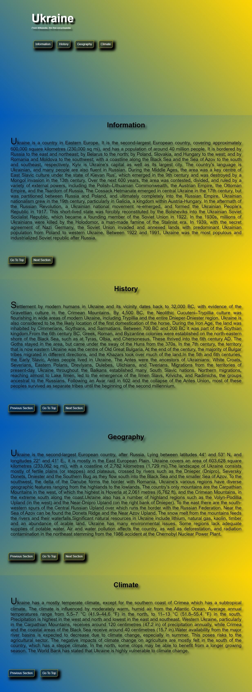

# Linear Gradient Task
## Objective:
> Make this page exactly like this image capture.You Should work in css/style.css file ONLY, <strong>DO NOT CHANGE</strong> ANY THING IN index.html file.



1. Clone this Repo Task to your PC.
2. Make the background for the header like Ukrainian Flag, using Linear Gradient with 45 degree & this two colors: ```#015bbb```, ```#fed500```.
3. For all elements, The width and height properties include the content, padding, and border, but do not include the margin. and set the default margin & padding 0.
4. target all anchors in the document, and make a style for them to be like a button, with the following values:
```css
    ALL_ANCHORS_SELECTOR{
        text-decoration: none;
        padding: 10px;
        text-align: center;
        color: white;
        display: inline-block;
        margin: 50px 1%;
        /* TODO 
         1- border size: 0.5px
         2- border color: #fed500
         3- border radius: only top-left & bottom-right 10px
         4- backgrond color: black with alpha= 0.5
         5- add a box-shadow
         6- delay-time: 0.5 second
        */ 
    }
```
5. Add a hover effect for all anchors with this values:
```css
ALL_ANCHORS_SELECTORS:HOVER{
    /*
    1- background: #fed500;
    2- color: black
    3- delay-time: 0.5 second
    */
}
```
6. Select all sections in the document, and make the following:
```css
ALL_SECTIONS_SELECTOR{
    /*
    1- make min height to be full view-port-height
    2- padding for each side 4vh
    3- add a shadow for the text inside with: offset-x=10px, offset-y=10px, blur=10px, color black with alpha= 0.5
    */
}
```
7. Select all odd numbers of sections, and make the background linear gradient with 135 degree with this two colors: ```#015bbb```, ```#fed500```.
8. Select all even numbers of sections, and make the background linear gradient with 45 degree with this two colors: ```#015bbb```, ```#fed500```.
9. Select all h2 tags inside each section, and apply the following:
```css
ALL_H2_IN_EACH_SECTION{
    /* 
    1- make the text in center
    2- font size 6vh
    3- margin from bottom 10px
    */
}
```
10. Select all paragraph in each sections, with following:
```css
ALL_PARAGRAPH_IN_EACH_SECTION{
    /*
    1- margin from bottom 10px
    2- font size 4vh
    3- justify the text
    4- padding for each side 2%
    5- make the first letter in each paragraph big with size: 200%
    */
}
```
11. For all elemets, try to add this command, and test the result:
```css
*{
    ...
    ...
    ...
    scroll-behavior: smooth;
}
```
12. Bonus: make this repository visible to all, by using github pages.
